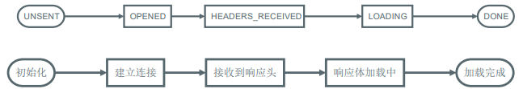

### AJAX概述

Web 程序最初的目的就是将信息（数据）放到公共的服务器，让所有网络用户都可以通过浏览器访问。


<!--more--> 

```
//1.在此之前，我们可以通过以下几种方式让浏览器发出对服务端的请求，获得服务端的数据：	地址栏输入地址，回车，刷新	特定元素的 href 或 src 属性	表单提交    a标签
//2.这些方案都是我们无法通过或者很难通过代码的方式进行编程（对服务端发出请求并且接受服务端返回的响应）
//3.如果我们可以通过JavaScript直接发送网络请求，那么Web的可能就会更多，随之能够实现的功能也会更多，至少不再是“单机游戏”。
```

AJAX（Asynchronous JavaScript and XML），是指使用JavaScript和XML进行**异步刷新局部网页的技术**。不是一种新的编程语言，是基于JavaScript、XML、HTML、CSS新用法。它使我们可以通过 JavaScript 直接获取服务端最新的内容而不必重新加载页面。让Web更能接近桌面应用的用户体验。

 说白了，AJAX 就是浏览器提供的一套 API，可以通过 JavaScript 调用，从而实现通过代码控制请求与响应。实现网络编程。

```
//同步(web1.0)：请求1-->等待-->响应1-->请求2-->等待-->响应2…
//异步(web2.0): 请求1-->请求2-->请求3-->响应1-->响应2-->响应3(局部刷新页面)
```

### AJAX核心概念

```
//1.JavaScript：更新局部的网页
//2.XML：一般用于请求数据和响应数据的封装(一般现在用JSON多)
//3.XMLHttpRequest对象（浏览器的内置对象）	(非IE浏览器：XMLHttpRequest)	(IE7以后XMLHttpRequest   IE7之前:ActiveXObject) 
//4.异步：发送请求后不等返回结果，由回调函数处理结果
```

### 快速使用

```
//Ajax的常用方法和属性
//1 发送Ajax请求	open(method,url,async) 与服务器建立连接(请求方式、请求url、是否需要异步)	send(content)  发送请求,content为请求参数 	setRequestHeader(header,value)  设置请求头
//2 请求回调	onreadystatechange：指定回调函数	readyState:  指XMLHttpRequest的状态信息      status：HTTP的状态码   200   403(没有访问权限)   404   500	responseText：获得响应的文本 	responseXML：获得响应的XML文档
```

### readyState 状态描述说明


### 时间轴!



```
var xhr = new XMLHttpRequest()console.log(xhr.readyState)// => 0// 初始化 请求代理对象    xhr.open('GET', 'time.php')console.log(xhr.readyState)// => 1// open 方法已经调用，建立一个与服务端特定端口的连接    
xhr.send()xhr.addEventListener('readystatechange', function () {	
	switch (this.readyState) {        
		case 2:            // => 2            
		// 已经接受到了响应报文的响应头            
		// 可以拿到头            
		// console.log(this.getAllResponseHeaders())            							console.log(this.getResponseHeader('server'))            // 但是还没有拿到体             console.log(this.responseText)            
		break        
		case 3:            // => 3            
		// 正在下载响应报文的响应体，有可能响应体为空，也有可能不完整            
		// 在这里处理响应体不保险（不可靠）            
		console.log(this.responseText)            
		break        
		case 4:            // => 4            
		// 一切 OK （整个响应报文已经完整下载下来了）            
		// 这里处理响应体            
		console.log(this.responseText)            
		break        
		}	
	})
```

通过理解每一个状态值的含义得出一个结论：一般我们都是在 readyState 值为 4 时，执行响应的后续逻辑。

```
xhr.onreadystatechange = function () {	
	if (this.readyState === 4) {		
		// 后续逻辑......	
	}
}
```

### 遵循 HTTP

本质上 XMLHttpRequest 就是 JavaScript 在 Web 平台中发送 HTTP 请求的手段，所以我们发送出去的请求仍然是HTTP 请求，同样符合 HTTP 约定的格式：

```
xhr.open('GET', './time.php')    		// 设置请求报文的请求行
xhr.setRequestHeader('Accept', 'text/plain')     		// 设置请求头
xhr.send(null)  			// 设置请求体
xhr.onreadystatechange = function () {	
	if (this.readyState === 4) {		// 获取响应状态码										console.log(this.status)		// 获取响应状态描述										console.log(this.statusText)		// 获取响应头信息									console.log(this.getResponseHeader('Content‐Type')) // 指定响应头					console.log(this.getAllResponseHeaders()) // 全部响应头		// 获取响应体				console.log(this.responseText) 			  // 文本形式		
		//console.log(this.responseXML) 		  // XML 形式，了解即可	
	}
}
```


